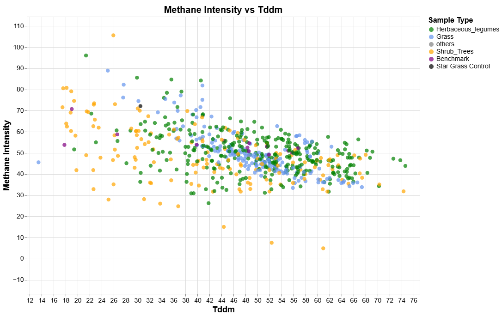

<p align="center">
  
</p>

# PROJECT REPOSITORY

## Overview

This repository contains Python and R notebooks developed in Google Colab for the analysis of methane production, digestibility, and nutritional traits of forage species.

The repository is organized into the following directories:

- **assets/** – Auxiliary files and assets. 
- **data/** – Input datasets used in the analyses.
- **notebooks/** – Google Colab notebooks containing the analysis workflows. Notebook filenames include the creation date and a brief description of the analysis performed.
- **output/** – Results generated by the notebooks, including processed datasets, figures, tables, reports, and other analysis outputs.

The notebooks are designed to facilitate reproducible data analysis and provide a structured workflow for exploring relationships between forage nutritional composition, digestibility, and methane emissions.

## Interactive Scatter Plot

Click the image below to open the interactive visualization.

[](assets/html/scatterplot.html)

## Interactive Scatter Plot

Explore the interactive scatter plot here:

➡️ https://maurope.github.io/low-methane-forages/assets/html/scatterplot.html

[](https://maurope.github.io/low-methane-forages/assets/html/scatterplot.html)

---

## Getting Started

Clone the repository directly into your Google Colab workspace:

```bash
!git clone https://github.com/maurope/lmf.git
%cd lmf
```

Alternatively, if you prefer to keep a persistent copy in your Google Drive:

```python
from google.colab import drive
drive.mount("/content/drive")
```

```bash
%cd /content/drive/MyDrive
!git clone  https://github.com/maurope/lmf.git
%cd lmf
```

After cloning the repository, open any notebook from the `notebooks/` directory and execute the cells sequentially.

---

## Requirements

The notebooks are designed to run in **Google Colab**. Additional Python packages required by a notebook can be installed directly within the notebook using `pip`.

---

## Repository Structure

```text
.
├── assets/        # Auxiliary files and assets
├── data/          # Input datasets
├── notebooks/     # Google Colab notebooks
├── output/        # Analysis results
└── README.md
```

---

## License

This repository is intended for research and educational purposes.
